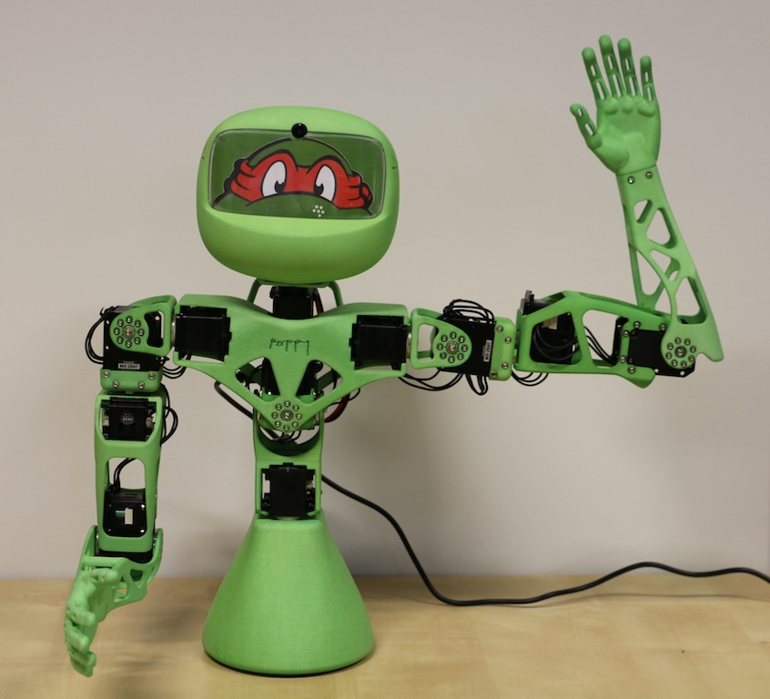
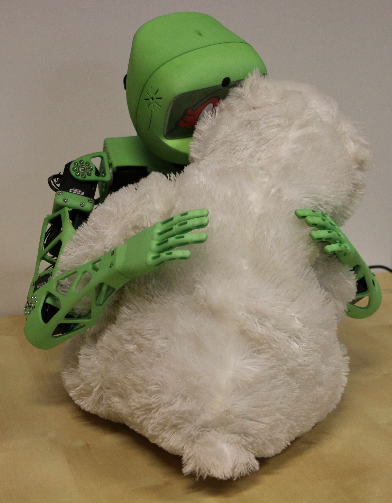
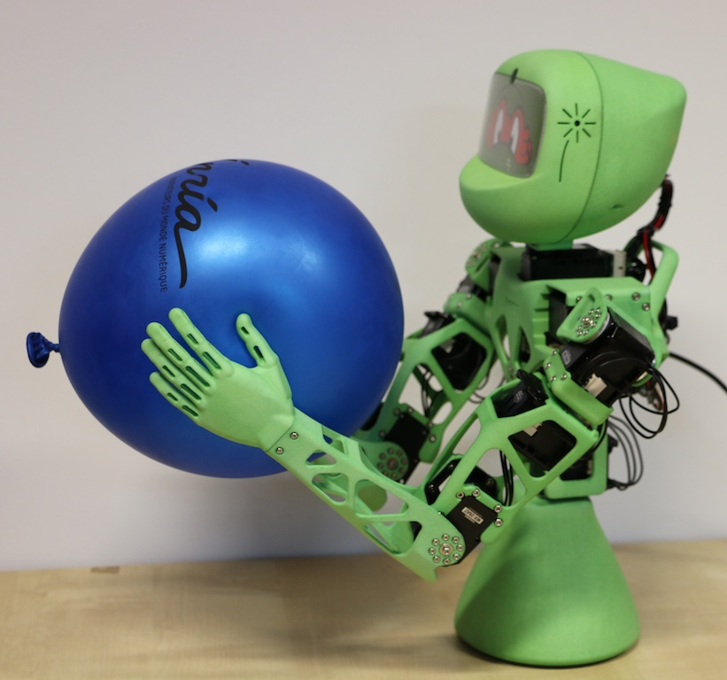

# Atelier _Poppy_ pour la Robot Maker's Day - 13 juin 2015 

 
 ---

---

## Atelier

* Realiser _**plusieurs mouvements**_ avec _Poppy Torso_ via _**Snap!**_
* Découvrir l'enregistrement de _**mouvements par démonstration**_ avec les bras de _Poppy Torso_

<table>
    <tr>
        
        <td>  </td>
        <td>  </td>
        <td>  </td> 
        
    </tr>
</table>

---
## Ressources Atelier

* Fiche nom des moteurs et fiche Snap! --> Poppy-Education/Images
